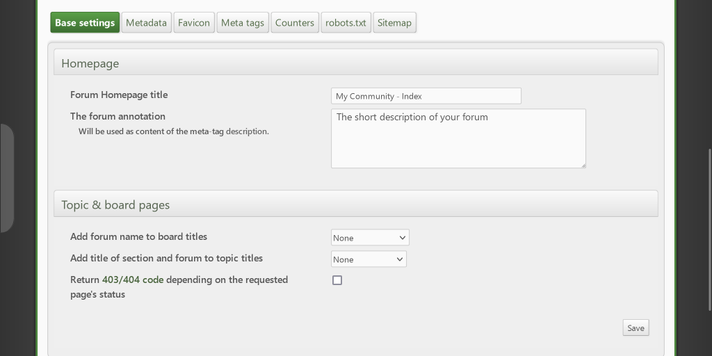
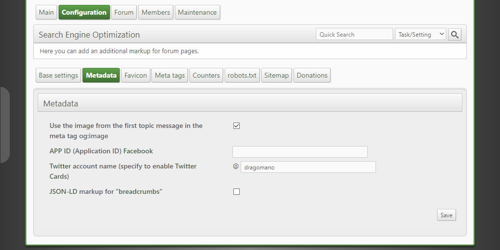
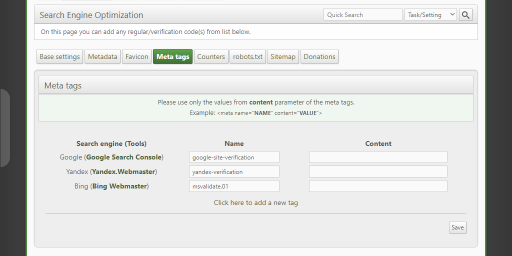
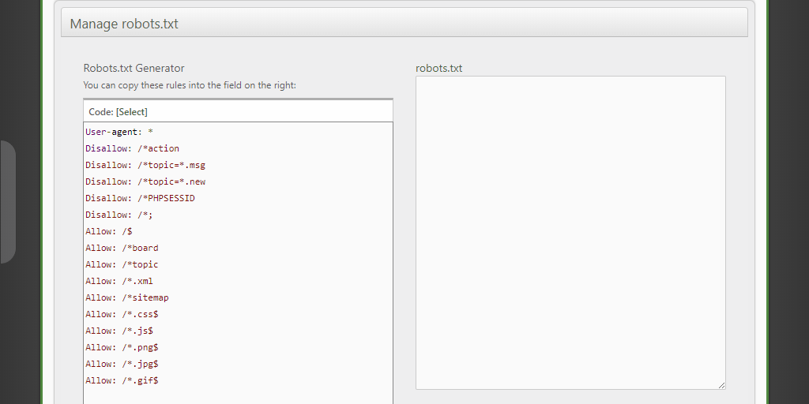

# Optimus for ElkArte

* **Author:** Bugo [dragomano.ru](https://dragomano.ru/mods/optimus)
* **License:** [Artistic License 2.0](https://opensource.org/licenses/artistic-license-2.0)
* **Compatible with:** ElkArte 1.1.x
* **Hooks only:** Yes
* **Languages:** Russian, English

## Описание
Модификация может помочь подготовить страницы ElkArte для индексации в поисковиках.

### Особенности:
* Изменение описания и заголовка главной страницы форума.
* Управление заголовками страниц тем и разделов.
* Мета-тег description для страниц разделов и тем.
* Поддержка тегов Open Graph, карточек Twitter и разметки JSON-LD для страниц форума.
* Проверочные мета-теги при добавлении сайтов в Google, Яндекс, Mail, Bing (Инструменты вебмастера).
* Пользовательские мета-теги.
* Добавление счетчиков без редактирования файлов шаблонов.
* Редактирование robots.txt из админки.
* Генератор правил для robots.txt.
* Создание карты форума (sitemap.xml).
* Поддержка favicon (иконка сайта).

## Description
This mod might help you solve some problems related with indexing of your ElkArte by search engines.

### Features:
* Managing of description & title metatags for your forum's frontpage, board and topic pages.
* Smart descriptions for topic pages.
* Open Graph meta-tags support.
* Twitter Cards and JSON-LD markup support.
* Ability to specify the verification codes when adding sites to Google, Yandex and Bing (Webmaster Tools).
* Adding of custom metatags.
* Changing the robots.txt from Settings page.
* Generator for robots.txt file.
* Simple Sitemap XML.
* Favicon Support.

