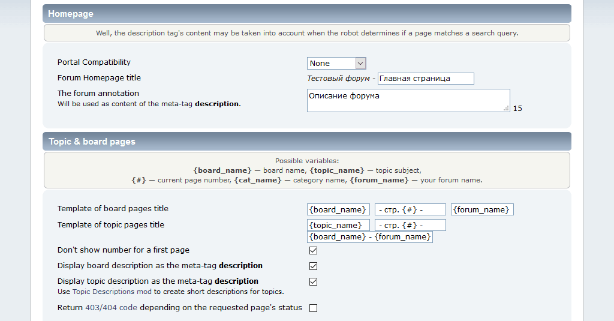
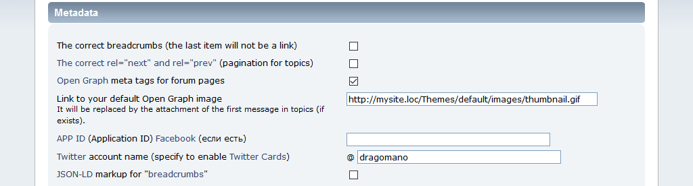
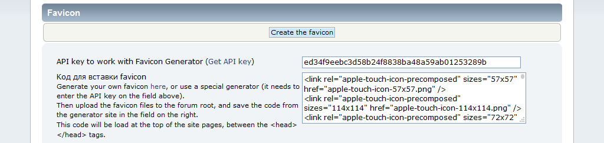
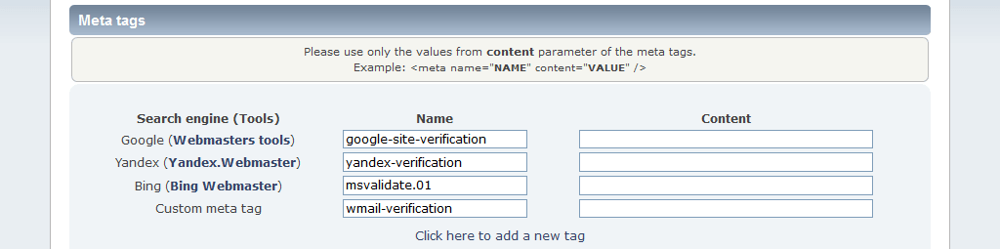
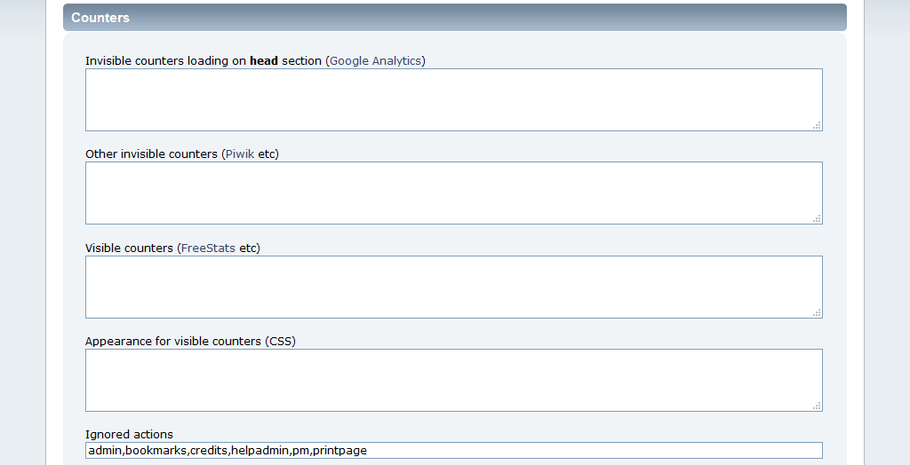
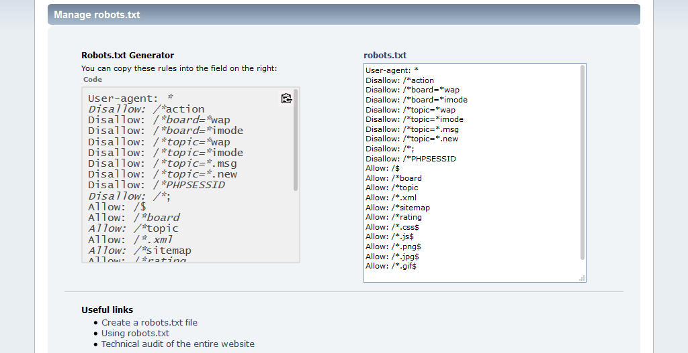
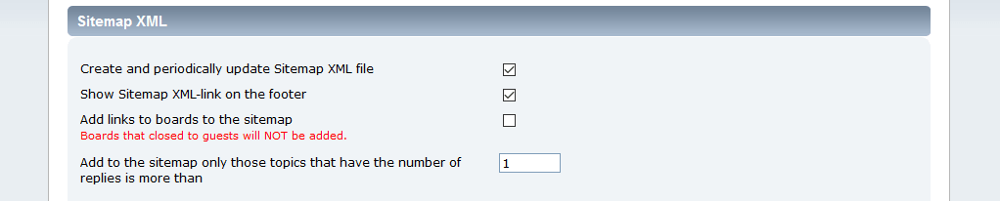

# SMF Optimus mod
* **Author:** Bugo [dragomano.ru](https://dragomano.ru/mods/optimus)
* **License:** [Artistic License 2.0](https://opensource.org/licenses/artistic-license-2.0)
* **Compatible with:** SMF 2.0.x
* **Hooks only:** Yes
* **Languages:** Dutch, English, French, Russian, Spanish, Turkish

## Description
This mod might help you solve some problems related with indexing of your forum by search engines.

### Features:
* Managing of description & title metatags for your forum's frontpage, board and topic pages.
* Smart descriptions for board/topic pages.
* Templates for titles of topic/board pages.
* Open Graph meta-tags support.
* Twitter Cards and JSON-LD markup support.
* Ability to specify the verification codes when adding sites to Google, Yandex and Bing (Webmaster Tools).
* Adding of custom metatags.
* Changing the robots.txt from Settings page.
* Generator for robots.txt file.
* Simple Sitemap XML.
* Favicon Support.

P.S. See **develop** branch for Optimus 2.x that works with SMF 2.1 RC2+.
The **portamx**, **elkarte** and **wedge** branches contain the mod versions for corresponding forks. Their functions may differ from those described above.

## Описание
Модификация упрощает оптимизацию страниц форума SMF для индексации в поисковиках.

### Особенности:
* Изменение описания и заголовка главной страницы форума.
* Отдельные заголовки главных страниц и тег canonical при использовании модов порталов (SimplePortal, PortaMx и некоторых других).
* Управление заголовками страниц тем и разделов (с помощью шаблонов).
* Мета-тег description для страниц разделов и тем.
* Поддержка тегов Open Graph, карточек Twitter и разметки JSON-LD для страниц форума.
* Проверочные мета-теги при добавлении сайтов в Google, Яндекс, Mail, Bing (Инструменты вебмастера).
* Пользовательские мета-теги.
* Добавление счетчиков без редактирования файлов шаблонов.
* Редактирование robots.txt из админки.
* Генератор правил для robots.txt.
* Создание карты форума (sitemap.xml).
* Поддержка favicon (иконка сайта).

P.S. Ветка **develop** содержит версию Optimus 2.x для SMF 2.1 RC2+.
В ветках **portamx**, **elkarte** и **wedge** находятся версии мода для соответствующих форков. Их функции могут отличаться от представленных выше.

